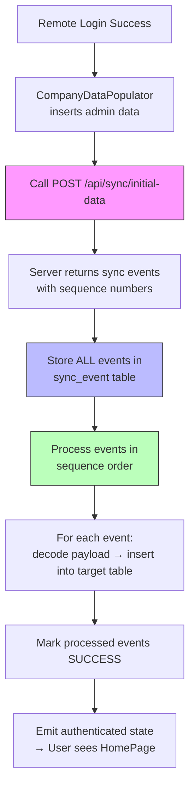

# Initial Data Sync via SyncEvent Table — Bulk Download on Login

## Problem

After remote login, `CompanyDataPopulator` inserts only the **admin/identity** data (company, branch, employee, user, roles, privileges, system constants, next numbers, FS table). The user's dashboards (Sales, Stock, Purchase, Availability) remain empty because the **business data** (items, customers, suppliers, purchase orders, sales orders, lots, locations, etc.) was never downloaded.

## Goal

1. After `CompanyDataPopulator` finishes, call a **new Java API endpoint** that returns ALL business data as **sync events** with a `sequence` number
2. **Store** the raw events in the `sync_event` table first (durability — survives crashes)
3. **Decode & apply** each event in `sequence` order to populate the local business tables
4. **Block the UI** during this entire process with a progress screen ("Setting up your data... 45%")
5. Add a `sequence` column to `sync_event` to enforce correct processing order

## Data Flow



## Event Sequence Order (from Server)

The server must send events in **dependency order** so foreign keys are satisfied:

| Sequence | Table | Why This Order |
|----------|-------|----------------|
| 1 | `udc_header` | Referenced by `udc_details` |
| 2 | `udc_details` | Referenced by items, lots, payments, etc. |
| 3 | `customer_table` | Referenced by sales orders |
| 4 | `supplier_table` | Referenced by purchase orders |
| 5 | `salespersons` | Referenced by company |
| 6 | `tax_rate_area` | Referenced by items |
| 7 | `items_table` | Referenced by everything stock-related |
| 8 | `item_master` | Item master definitions |
| 9 | `items_in_branch` | Item availability per branch |
| 10 | `item_uom_conversions` | UoM conversion factors |
| 11 | `item_cost` | Item cost records |
| 12 | `location_master` | Locations in branch |
| 13 | `item_location` | Items in specific locations |
| 14 | `lot_master` | Lot/batch tracking |
| 15 | `lot_expiration_colors` | Lot expiration rules |
| 16 | `purchase_order_header` | PO headers |
| 17 | `purchase_order_detail` | PO line items |
| 18 | `purchase_order_receiver` | PO receiving records |
| 19 | `sales_order_header` | SO headers |
| 20 | `sales_order_details` | SO line items |
| 21 | `sales_return_header` | Return headers |
| 22 | `sales_return_details` | Return line items |
| 23 | `quote_order_header` | Quotation headers |
| 24 | `quote_order_details` | Quotation line items |
| 25 | `invoice_history_header` | Invoice headers |
| 26 | `invoice_history_detail` | Invoice line items |
| 27 | `item_transactions` | Stock transaction history |
| 28 | `credit_payment_table` | Purchase credit payments |
| 29 | `credit_receipt_table` | Sales credit receipts |
| 30 | `other_expense_table` | Other expenses |
| 31 | `other_income_table` | Other income |
| 32 | `fast_slow_nonmoving_rule_table` | FSNMR rules |
| 33 | `subscription_management` | Subscription plans |

---

## Proposed Changes

### Component 1: Database Schema — Add `sequence` column to `sync_event`

#### [MODIFY] [database_service.dart](file:///c:/flutterApps/savvy_lite_new/lib/core/services/database/database_service.dart)

Add a `sequence` column to the `sync_event` CREATE TABLE statement:

```diff
 CREATE TABLE sync_event (
   id INTEGER PRIMARY KEY AUTOINCREMENT,
   entity_name TEXT NOT NULL CHECK(length(entity_name) <= 255),
   entity_id TEXT CHECK(length(entity_id) <= 100),
   operation TEXT NOT NULL CHECK(length(operation) <= 10),
   payload TEXT NOT NULL,
   source_node TEXT CHECK(length(source_node) <= 20),
   created_at TEXT,
   company TEXT CHECK(length(company) <= 100),
   source_key TEXT CHECK(length(source_key) <= 100),
   source_address TEXT CHECK(length(source_address) <= 100),
   source_id TEXT CHECK(length(source_id) <= 100),
-  sync_status TEXT DEFAULT 'PENDING' CHECK(length(sync_status) <= 20)
+  sync_status TEXT DEFAULT 'PENDING' CHECK(length(sync_status) <= 20),
+  sequence INTEGER DEFAULT 0
 )
```

Also bump the DB version and add migration logic in `_onUpgrade` to `ALTER TABLE sync_event ADD COLUMN sequence INTEGER DEFAULT 0`.

---

### Component 2: Update `SyncEventModel` — Add `sequence` field

#### [MODIFY] [sync_event_model.dart](file:///c:/flutterApps/savvy_lite_new/lib/core/services/sync/models/sync_event_model.dart)

Add `sequence` field to the model, `fromMap`, `toMap`, and `copyWith`.

---

### Component 3: New Service — `InitialDataSyncService`

#### [NEW] `lib/features/auth/services/initial_data_sync_service.dart`

This is the core new service. Responsibilities:

1. **Download**: Call `POST /api/sync/initial-data` with `{ company_sync_key, user_sync_key }` → server returns a list of sync events with `sequence` numbers
2. **Store**: Insert all events into `sync_event` table with `sync_status = 'INITIAL_PENDING'` (a new status to differentiate from normal sync events)
3. **Process**: Query events `WHERE sync_status = 'INITIAL_PENDING' ORDER BY sequence ASC, created_at ASC`, then for each event:
   - Decode `payload` JSON
   - Remap foreign key IDs using `sync_key` lookups (same pattern as `CompanyDataPopulator._upsertBySyncKey`)
   - Insert/upsert into the target table
   - Mark the event as `SUCCESS`
4. **Progress**: Expose a `Stream<InitialSyncProgress>` so the UI can show percentage and current table name

```dart
class InitialSyncProgress {
  final int totalEvents;
  final int processedEvents;
  final String currentTable;
  final String message;
  
  double get percentage => totalEvents > 0 
    ? (processedEvents / totalEvents * 100) 
    : 0;
}
```

Key design decisions:
- **Batch inserts using `db.batch()`**: Instead of processing events one by one, group events by `entity_name` (table) and use `Batch.insert()` for speed
- **Transaction per table group**: Each table's batch runs in its own transaction so a failure in one table doesn't roll back all previous tables
- **ID remapping map**: Maintain a `Map<String, Map<String, int>>` keyed by `tableName → sync_key → localId` for foreign key resolution across tables

---

### Component 4: Update `RemoteAuthService` — Add `fetchInitialData` method

#### [MODIFY] [remote_auth_service.dart](file:///c:/flutterApps/savvy_lite_new/lib/features/auth/services/remote_auth_service.dart)

Add a new method:

```dart
Future<List<Map<String, dynamic>>> fetchInitialData({
  required String companySyncKey,
  required String userSyncKey,
  required String serverToken,
}) async { ... }
```

This calls the Java server's `POST /api/sync/initial-data` endpoint and returns the raw list of event maps.

---

### Component 5: Update `AuthBloc` — Add initial sync step and new state

#### [MODIFY] [auth_bloc.dart](file:///c:/flutterApps/savvy_lite_new/lib/features/auth/blocs/auth_bloc.dart)

After `CompanyDataPopulator` succeeds (Step 3), add a new **Step 3.5**:

```dart
// ─── Step 3.5: Download & apply business data ───────────────
emit(AuthState(
  status: AuthStatus.initialSyncInProgress,
  message: 'Downloading your data...',
  syncProgress: 0,
  syncTable: '',
));

await initialDataSyncService.downloadAndApply(
  companySyncKey: response.company!['sync_key'],
  userSyncKey: response.user!['sync_key'],
  serverToken: response.serverToken!,
  onProgress: (progress) {
    emit(AuthState(
      status: AuthStatus.initialSyncInProgress,
      message: progress.message,
      syncProgress: progress.percentage,
      syncTable: progress.currentTable,
    ));
  },
);
```

Add new dependency: `InitialDataSyncService`

#### [MODIFY] [auth_state.dart](file:///c:/flutterApps/savvy_lite_new/lib/features/auth/blocs/auth_state.dart)

Add:
- `AuthStatus.initialSyncInProgress` enum value
- `double? syncProgress` field
- `String? syncTable` field

---

### Component 6: Update `SyncStatus` — Add `INITIAL_PENDING` status

#### [MODIFY] [sync_event_model.dart](file:///c:/flutterApps/savvy_lite_new/lib/core/services/sync/models/sync_event_model.dart)

```diff
 class SyncStatus {
   static const String pending = 'PENDING';
   static const String inProgress = 'IN_PROGRESS';
   static const String success = 'SUCCESS';
   static const String failed = 'FAILED';
+  static const String initialPending = 'INITIAL_PENDING';
 }
```

---

### Component 7: Update Login Screen UI — Blocking progress overlay

#### [MODIFY] Login screen (wherever `AuthStatus` is consumed)

When `AuthStatus.initialSyncInProgress` is emitted, show a **full-screen blocking overlay** with:
- Company logo / app logo
- Animated progress bar showing `syncProgress` percentage
- Text showing `syncTable` (e.g., "Syncing items... 45%")
- **No back button / no dismiss** — the user must wait

---

### Component 8: Dependency Injection

#### [MODIFY] [injection_container.dart](file:///c:/flutterApps/savvy_lite_new/lib/core/di/injection_container.dart)

Register:
- `InitialDataSyncService` (depends on `RemoteAuthService`, `SyncRepository`, `LocalDatabaseService`)
- Update `AuthBloc` constructor to accept `InitialDataSyncService`

---

## User Review Required

> [!IMPORTANT]
> **Java Server Endpoint**: You need to create `POST /api/sync/initial-data` on the Java server. It should:
> 1. Accept `{ "company_sync_key": "...", "user_sync_key": "..." }`
> 2. Query ALL active business data for that company
> 3. Return each row as a sync event with `entity_name`, `operation: "INSERT"`, `payload` (JSON of the row), `sequence` (ordering number), `created_at`, and `source_key` (the row's `sync_key`)
> 4. Events must be ordered by the sequence table shown above
>
> **Is this endpoint already built, or do you need a spec for it?**

> [!IMPORTANT]
> **Database Version Bump**: Adding the `sequence` column to `sync_event` requires bumping the DB version from 1 to 2 and adding an ALTER TABLE migration.
>
> **Do existing users already have data in the sync_event table that needs to be preserved, or can we safely delete + recreate?**

> [!WARNING]
> **ID Remapping Complexity**: The business data coming from the server uses server-side auto-increment IDs. All foreign keys (e.g., `sales_order_header.customer_table_id → customer_table.id`) must be remapped to local IDs using `sync_key` lookups. This is the most complex part of the implementation.
>
> **Does every single table row on the server have a `sync_key` UUID?** If not, some rows may fail to remap correctly.

## Open Questions

1. **Should the initial sync happen ONLY on the very first remote login?** If a user logs in again on the same device, their data is already local — we should skip the bulk download. I propose checking: "Does local DB already have items for this company? If yes, skip initial sync."

2. **Data size**: Approximately how many total rows across all tables for a typical company? This affects whether we need streaming/pagination or can download in one shot.

3. **UDC data**: `udc_header` and `udc_details` are system-level data already seeded by `DefaultDataSeeder`. Should the server send company-specific UDC entries, or can we skip those?

## Verification Plan

### Automated Tests
- Unit test `InitialDataSyncService.downloadAndApply()` with mocked HTTP response
- Verify events are stored in `sync_event` with correct `sequence` values
- Verify events are processed in correct order
- Verify all target tables have correct data after processing
- Verify foreign key remapping via `sync_key`

### Manual Verification
1. Register Company A with User A on Device 1
2. Create items, customers, suppliers, sales orders, etc. on Device 1
3. Create User B with Sales role on Device 1 → syncs to server
4. Install app on Device 2 (fresh DB)
5. Login as User B on Device 2 → observe progress screen blocking UI
6. After sync completes → verify all dashboards show correct data
7. Verify Sales dashboard shows sales orders, customers
8. Verify Stock dashboard shows items, locations, lots
9. Verify Purchase dashboard shows suppliers, POs
